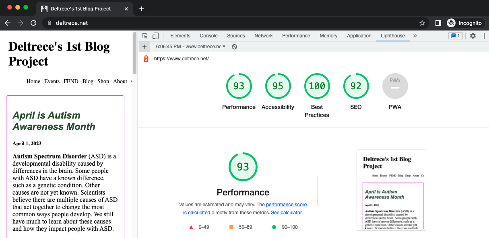

# :file_folder: Project Title
## :one: My First Coded Blog Project

## Table of Contents

* [Description](#memo-description)
* [Goals](#chart-goals)
* [How_to_Use_Project](#computer-how-to-use-project)
* [Credits](#family_man_woman_girl_boy-credits)
* [How_to_Contribute](#pen-how-to-contribute)
* [Resources](#books-resources)
* [Lighthouse_Report](#bulb-house-lighthouse-report)
* [License](#ballot_box_with_check-license)

## :memo: Description

This project began as a blank file of HTML and CSS styling to satisfy requirements for Udacity's Front End Web Development Nano Degree Program.  This project will be modified with new knowledge gained over time. 

## :chart: Goals
* Learn html language
* Learn css language
* Learn javascript language
* Share content 
* Build a business

## :computer: How to Use Project

View in your browser and interactive with the features and inputs on the web pages.  Alternatively utilize a screen reading app to have the text read to you.

## :family_man_woman_girl_boy: Credits

Myself, along with Udacity session leaders and peers.

## :pen: How to Contribute

Fork this project and personalize it to your desire.

## :books: Resources

Udacity clssroom module, library books, YouTube videos & other web developers & designers.

## :bulb: :house: Lighthouse Report

Accessibility Results: 

## :ballot_box_with_check: License

[License](LICENSE.txt)

[(Back to top)](#table-of-contents)

